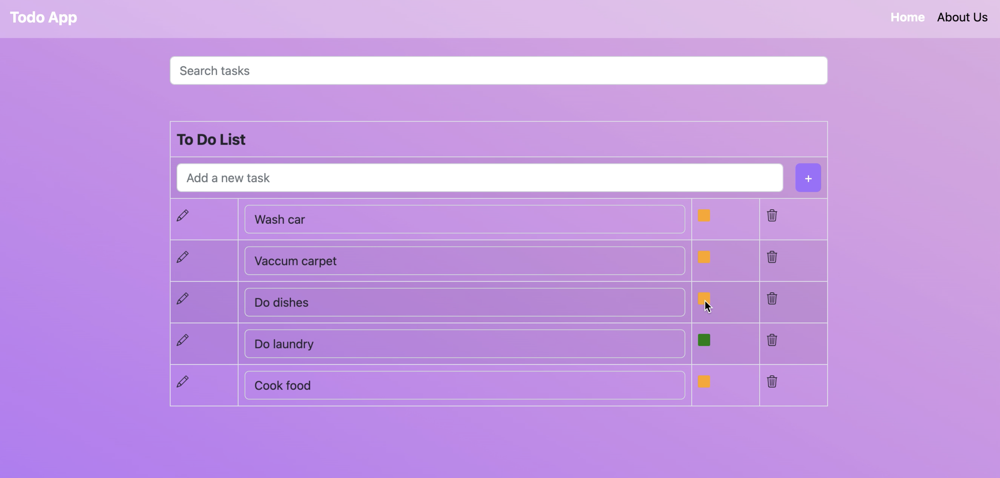

# Sample todo frontend

This repository provides a sample React app styled using [Bootstrap](https://react-bootstrap.github.io/), designed to help users manage their to-do tasks.
The app provides a simple and intuitive interface for adding, editing, and deleting tasks, as well as marking tasks as complete.

## Features

- Add, edit and delete tasks
- Ability to mark tasks complete with a visual color coding
- Users can search for tasks by description.
- The app is optimized for viewing on multiple devices, including desktop, tablet, and mobile.

## Usage

- Clone the repository to your machine.
- Install the npm dependencies using `npm install`.
- Run the app in development mode using `npm start`. Open <http://localhost:3000> to view it in the browser.

The application works with this [To-do backend application](https://github.com/djain401/sample-todo-backend).

## Demo

Below video shows the demo of the todo app.

> This project is just for demo and not fit for use in producion.

## Backlog

The project is currently just a minimum viable product
and needs below features developed to make it
useful for real-world use-cases.

- [ ] Filter tasks: Users can filter tasks by completion status, priority, or category.
- [ ] Set reminders: Users can set reminders for tasks to ensure that they don't forget to complete them.
- [ ] Categories: Users can categorize tasks based on their type (work, personal, etc.).
- [ ] Dark mode: Users can switch between light and dark mode for improved visibility and aesthetics.
- [ ] User authentication: Users can create an account and log in to access their personal to-do list. This feature ensures that each user's data is kept private and secure.

## Reference

This project was bootstrapped with [Create React App](https://github.com/facebook/create-react-app).